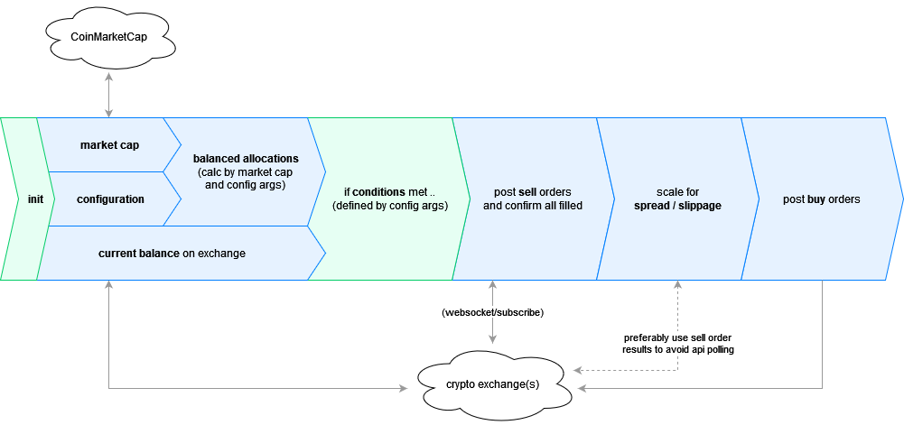
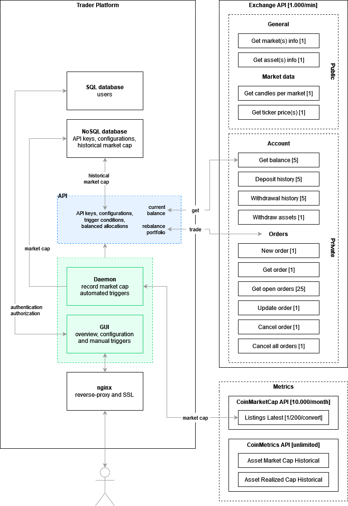

# TraderEngine

## Flow chart of logic to rebalance a portfolio

This flow chart is a result of the learnings from the [trader-plugin](https://github.com/bvandevliet/trader-plugin) project. It illustrates the actions required to rebalance a portfolio. It is plotted on a timeline and shows what can be done in parallel and what must be done consecutively.



## Platform architecture on macro level

The platform is a collection of components that work together. Each component is responsible for specific tasks. The colors correspond to the actions in the flow chart for which the component is responsible. A GUI is added to the architecture for completeness, but is outside of the scope of this project. In this approach, the GUI handles users, authentication and authorization. TraderEngine is intended to be an non-exposed internal API that is purely focussed on doing the hard trader work.



## Running & debugging locally

There are three ways to run the stack, depending on what you're doing:

**Native debugging (fastest iteration).** Run TraderEngine.API and TraderEngine.Web as regular .NET processes from Visual Studio (F5, no Docker involved for the apps themselves); only Postgres runs in a container, exposed to the host:

```
docker compose -f docker-compose.yml -f docker-compose.debug.yml up -d traderengine.postgres
```

**Full container debugging (one-click, closer to production topology).** Set `docker-compose` as the startup project in Visual Studio and hit F5. Both API and Web build and debug *inside* containers via Fast Mode (built on the host, mounted into the container — no manual `docker compose` command needed). See `docker-compose.dcproj`.

**Production / manual full stack:**

```
docker compose --env-file .env.example --env-file .env up -d
```

Uses each project's production `Dockerfile`, which expects a prior `dotnet publish -c Release` (this is what CI does before building the image).

**One-shot WordPress → Postgres migration (on demand only, never runs otherwise):**

```
docker compose --env-file .env.example --env-file .env -f docker-compose.yml -f docker-compose.migrate.yml run --rm traderengine.migrate
```

### File reference

| File | Purpose | Used by |
|---|---|---|
| `docker-compose.yml` | Base service definitions (Postgres, API, Web) — source of truth for production. | All scenarios |
| `docker-compose.debug.yml` | Exposes Postgres on `localhost:5432`; redirects the API/Web build to `Dockerfile.debug` with the build context widened to the repo root. Not auto-loaded by a plain `docker compose` invocation. | Manually via `-f`, or by `docker-compose.dcproj` via `AdditionalComposeFilePaths` |
| `docker-compose.migrate.yml` | Defines `traderengine.migrate`, gated behind the `migrate` profile so it never starts by accident. Deliberately **not** referenced by `docker-compose.dcproj` in any way — VS's F5 flow expects a container for every service in whatever files it loads, regardless of `profiles:`, so wiring this in would break F5 the same way the old `docker` profile did. | Manually via `-f`, on demand only |
| `docker-compose.dcproj` | Visual Studio's Docker Compose project — wires up `docker-compose.yml` + `docker-compose.debug.yml` + env files for one-click F5. | Visual Studio only |
| `TraderEngine.API/Dockerfile`, `TraderEngine.Web/Dockerfile` | Production images: thin, expect a prebuilt `bin/Release/.../publish`. | Production deploys, CI |
| `TraderEngine.API/Dockerfile.debug`, `TraderEngine.Web/Dockerfile.debug` | Self-contained: build from source inside the image. VS Fast Mode only. | `docker-compose.debug.yml` only |

`.env.example` (committed) holds default values; `.env` (gitignored) holds your private overrides and wins on any conflicting key. Pass both `--env-file` flags in that order for manual commands; Visual Studio does this automatically via `DockerComposeEnvFilePaths` in the `.dcproj`.