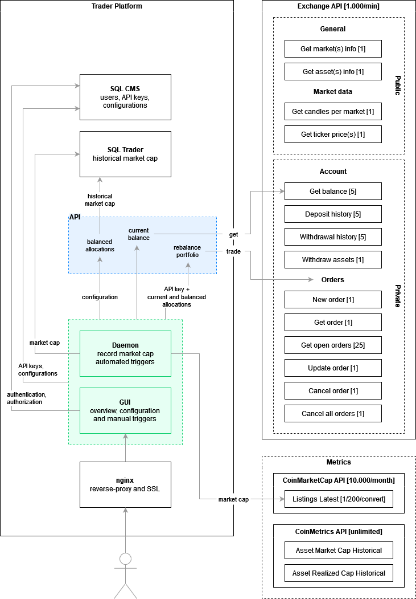

# TraderEngine

## Flow chart of logic to rebalance a portfolio

This flow chart is a result of the learnings from the [trader-plugin](https://github.com/bvandevliet/trader-plugin) project. It illustrates the actions required to rebalance a portfolio. It is plotted on a timeline and shows what can be done in parallel and what must be done consecutively.

## Platform architecture on macro level

The platform is a collection of components that work together. Each component is responsible for specific tasks. The colors correspond to the actions in the flow chart for which the component is responsible. A GUI is added to the architecture for completeness, but is outside of the scope of this project. In this approach, the GUI handles users, authentication and authorization. TraderEngine is intended to be an non-exposed internal API that is purely focussed on doing the hard trader work.

